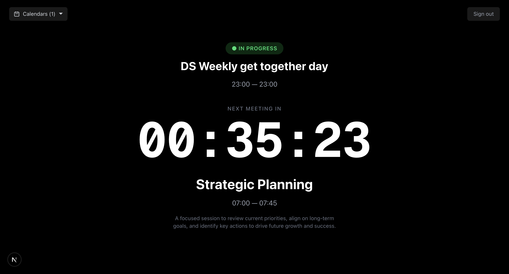

# Calendar Countdown

A real-time countdown dashboard showing the time remaining until your next Google Calendar meeting. Dark minimal UI with large monospace digits, live event details, and multi-calendar support.

  



## Features

- **Real-time countdown** — hours, minutes, and seconds ticking every second
- **Current meeting indicator** — shows "In Progress" badge when a meeting is active
- **Next meeting details** — name, time, location, description, and Google Meet join button
- **Multi-calendar support** — checkbox picker to select which Google Calendars to track
- **Auto-refresh** — re-fetches events every 60 seconds, transitions automatically when meetings start/end
- **Token refresh** — handles Google OAuth token expiry seamlessly
- **Dark minimal design** — black background, white monospace digits, centered layout

## Tech Stack

- **Next.js 16** (App Router, Turbopack)
- **Auth.js v5** (next-auth@beta) — Google OAuth with calendar scope
- **Google Calendar API** via `googleapis`
- **Tailwind CSS 4**
- **TypeScript**

## Setup

### 1. Google Cloud Project

1. Go to [Google Cloud Console](https://console.cloud.google.com) and create a new project
2. Navigate to **APIs & Services → Library**, search for **Google Calendar API**, and click **Enable**
3. Go to **APIs & Services → OAuth consent screen**:
   - Choose **External** user type
   - Fill in app name and support email
   - Add scope: `https://www.googleapis.com/auth/calendar.readonly`
   - Add your Gmail address as a **test user**
4. Go to **APIs & Services → Credentials → Create Credentials → OAuth client ID**:
   - Application type: **Web application**
   - Add authorized redirect URI: `http://localhost:3000/api/auth/callback/google`
5. Copy the **Client ID** and **Client Secret**

### 2. Environment Variables

```bash
cp .env.example .env.local
```

Fill in your values:

```
GOOGLE_CLIENT_ID=your-client-id
GOOGLE_CLIENT_SECRET=your-client-secret
AUTH_SECRET=<run: openssl rand -base64 32>
NEXTAUTH_URL=http://localhost:3000
```

### 3. Install & Run

```bash
npm install
npm run dev
```

Open [http://localhost:3000](http://localhost:3000), sign in with Google, and see your countdown.

## Project Structure

```
src/
├── app/
│   ├── page.tsx                          # Login page (Google sign-in button)
│   ├── layout.tsx                        # Root layout (dark theme, fonts)
│   ├── providers.tsx                     # SessionProvider wrapper
│   ├── dashboard/
│   │   └── page.tsx                      # Protected dashboard (server component)
│   └── api/
│       ├── auth/[...nextauth]/route.ts   # Auth.js API handler
│       └── calendar/
│           ├── list/route.ts             # GET — list user's calendars
│           └── next-event/route.ts       # GET — current + next event
├── components/
│   └── CountdownDashboard.tsx            # Main countdown UI (client component)
├── lib/
│   ├── auth.ts                           # Auth.js config, Google provider, token refresh
│   └── google-calendar.ts               # Calendar API utilities
└── types/
    └── next-auth.d.ts                    # Session/JWT type augmentation
```

## Deploy to Vercel

1. Push your repo to GitHub
2. Import the repo at [vercel.com](https://vercel.com)
3. Add the same environment variables in the Vercel project settings
4. Add your Vercel production URL as an authorized redirect URI in Google Cloud Console:
   ```
   https://your-app.vercel.app/api/auth/callback/google
   ```

## License

MIT